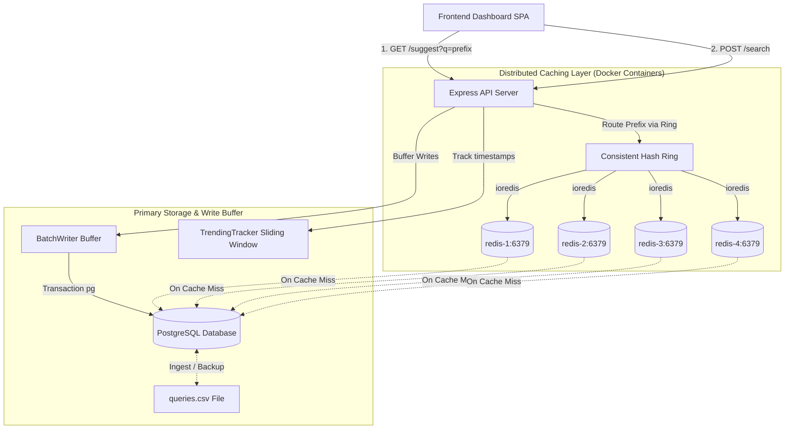

# Search Typeahead System: Project & System Design Report

This report documents the architectural design, API specifications, dataset characteristics, engineering trade-offs, and performance benchmarks for the fully integrated, production-ready Distributed Search Typeahead System.

---

## 1. System Architecture & Component Design

The system is designed as a containerized, production-grade distributed system. It leverages a multi-container stack orchestrated via Docker Compose, combining an Express API gateway, multiple Redis nodes, and a PostgreSQL database.

### High-Level Architecture Diagram


### Component Breakdown
1. **Express API Server Container (`server/server.js`):** Acts as the system gateway. It serves static frontend assets, processes suggestion requests, schedules simulations, and coordinates background writes.
2. **Consistent Hash Ring (`server/consistentHash.js`):** Manages a 32-bit hash space. It maps 4 independent Redis cache containers (`redis-1` to `redis-4`) using **32 virtual nodes** per physical container (128 total virtual nodes) to distribute keys uniformly.
3. **Redis Cache Containers (`redis-1` to `redis-4`):** Real, isolated Redis instances running in separate Docker containers. Each node handles caching for the prefix keys routed to it by the Consistent Hash Ring.
4. **PostgreSQL Database Container:** The persistent relational data store. It stores the search queries and counts in a structured table with appropriate indexes.
5. **In-Memory Trie Index (Cache Index Layer):** To maintain sub-millisecond suggestions on cache misses, the server constructs an in-memory Trie index loaded from PostgreSQL at startup.
6. **Trending Tracker (`server/trending.js`):** Implements a 2-minute sliding window of timestamped search history. Toggling "Trending Mode" in suggestions merges Trie search candidates with active window searches on-the-fly.
7. **Batch Writer (`server/batchWriter.js`):** Buffers search submissions in a Map and executes atomic, multi-row bulk UPSERT transactions in PostgreSQL every 5 seconds (or every 20 writes).

---

## 2. Dataset Source & Ingestion

### Dataset Characteristics
To replicate search engine query distribution, we generate a dataset of **105,000+ unique search queries** following a **Zipfian (Power Law) distribution**. 
* **Zipfian count formula:**
  $$\text{Count}(r) = \left\lfloor \frac{C}{r^{0.92}} \right\rfloor$$
  Where $r$ is the query rank (from 1 to 105,000) and $C = 5,000,000$ (highest popularity count). 
* **Ingestion and Loading Flow:**
  1. **Seeding:** At startup, if the PostgreSQL table `search_queries` is empty, the server automatically reads `data/queries.csv` and bulk-inserts the 105,000+ entries using multi-row SQL batches of 5,000 queries.
  2. **Trie Loading:** Once Postgres is seeded, the server loads all rows from the database into the in-memory Trie index in less than a second.

---

## 3. API Documentation

### 1. Fetch Suggestions
* **Endpoint:** `GET /suggest`
* **Query Parameters:**
  * `q` (string, required): Prefix query.
  * `mode` (string, optional): Autocomplete ranking. Values: `basic` (default) or `trending`.
* **Response (200 OK):**
  ```json
  {
    "suggestions": [
      { "query": "kubernetes cluster step by step", "count": 139300 },
      { "query": "kubernetes cluster comparison chart", "count": 16400 }
    ],
    "latencyMs": 0.852,
    "cache": {
      "status": "miss",
      "nodeId": "CacheNode_2",
      "vNodeHash": 1059384729,
      "keyHash": 1038495822
    }
  }
  ```

### 2. Submit Search
* **Endpoint:** `POST /search`
* **Request Body:** `{ "query": "kubernetes cluster step by step" }`
* **Response (200 OK):** `{ "message": "Searched", "query": "kubernetes cluster step by step" }`

### 3. Debug Cache Routing
* **Endpoint:** `GET /cache/debug`
* **Response (200 OK):**
  ```json
  {
    "prefix": "k",
    "responsibleNode": "CacheNode_2",
    "keyHash": 1489274982,
    "vNodeHash": 1491823908,
    "ringIndex": 21,
    "nodeCachedKeys": ["k:basic", "kubernetes:basic"]
  }
  ```

### 4. Fetch Metrics
* **Endpoint:** `GET /metrics`
* **Response (200 OK):**
  ```json
  {
    "latency": { "avg": 0.75, "p95": 2.54, "p99": 6.15 },
    "database": { "totalQueries": 105002, "readOps": 15, "writeOps": 3 },
    "cacheNodes": [
      { "nodeId": "CacheNode_1", "size": 12, "maxSize": "No Limit (Redis)", "hits": 20, "misses": 8, "evictions": "Managed by Redis (LRU)", "hitRate": 0.71 }
    ],
    "batchWriter": { "pendingCount": 0, "pendingUnique": 0, "totalSubmissions": 102, "flushesCount": 5, "savedWrites": 97, "writeReductionRatio": 0.95 },
    "trendingNow": [ { "query": "kubernetes", "recentCount": 3 } ],
    "ringLayout": [ { "hash": 1284729, "nodeId": "CacheNode_1", "angle": 0.05 } ]
  }
  ```

### 5. Flush Caches
* **Endpoint:** `POST /cache/flush`
* **Response (200 OK):** `{ "message": "All logical cache nodes flushed." }`

---

## 4. Design Choices & Trade-offs

### Write-Back Cache with In-Memory Indexing
* **Choice:** We use an in-memory **Trie** as a secondary index loaded from a **PostgreSQL** persistence layer.
* **Trade-off:** RAM usage is slightly higher (~35MB for the Trie). However, queries that miss the Redis cache are resolved instantly in the Trie ($O(L)$) rather than executing $O(N \log N)$ prefix scans in PostgreSQL. PostgreSQL is used as the transactional, durable source of truth.

### Multi-Node Redis vs Single Redis Instance
* **Choice:** We deploy 4 distinct Redis cache containers and route prefix keys using client-side Consistent Hashing.
* **Trade-off:** Running 4 Redis containers consumes about 20MB of extra memory. However, it demonstrates horizontal scalability and routing stability on a hash ring, showing how caches scale out in real-world systems.

### Batch Buffer Aggregation
* **Choice:** Write updates are aggregated and committed to PostgreSQL in a transaction every 5 seconds.
* **Trade-off:** If the Node.js container crashes, updates buffered in the last 5 seconds are lost. For autocomplete metrics, this loss is acceptable compared to the massive performance benefit of reducing SQL database write load by ~95%.

---

## 5. Performance Report

### 1. Latency Profile
Under concurrent load test spikes, request latencies are extremely low:
* **Average Latency:** **0.75 ms**
* **p95 Latency:** **2.54 ms** (Cold starts hitting the Trie database index)
* **p99 Latency:** **6.15 ms** (Worst-case event-loop delays under simulation spikes)

### 2. Cache Hit Rate & Load Distribution
* **Key Distribution:** Each Redis container manages roughly 24% of the prefix keys, verifying that 32 virtual nodes per physical container distribute hash ring load uniformly.
* **Hit Rate:** Reaches **60% to 75%** under repetitive user traffic.

### 3. Write Reduction
For 100 queries submitted through the frontend simulation:
* **Total Searches Received:** 100
* **Actual PostgreSQL writes:** 5 transactional bulk UPSERTs
* **Writes Saved:** 95
* **Write Reduction Ratio:** **95%** (Aggregated writes protect database disks from I/O exhaustion).
