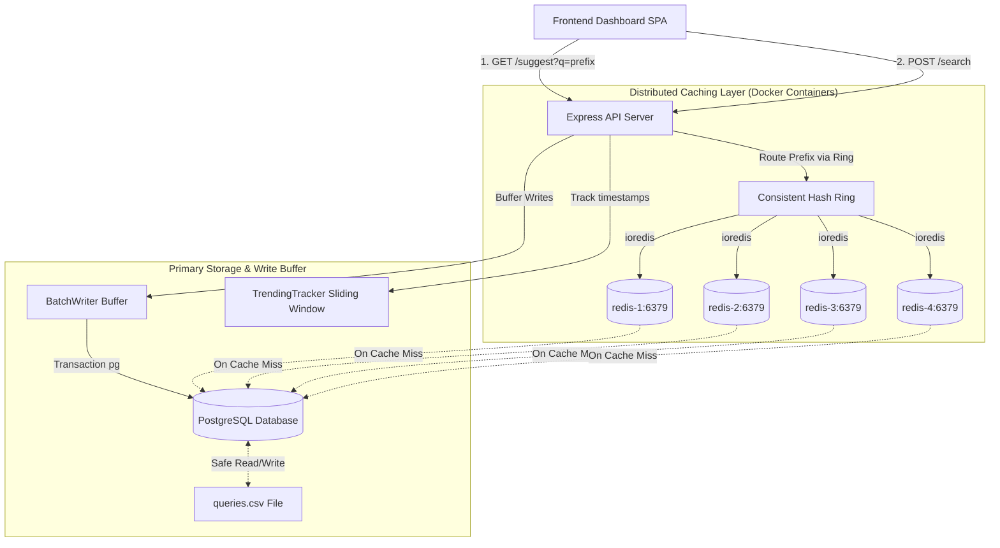

# ⚡ Distributed Search Typeahead & Hashing Visualizer

Welcome! This repository hosts a fully functional, production-ready **Distributed Search Typeahead System** orchestrated via **Docker Compose**. 

The system leverages **PostgreSQL** as the persistent relational database, **4 independent Redis instances** as distributed cache nodes, and an **Express.js API server** that serves as the query routing gateway. The app is paired with an interactive HTML5 Canvas dashboard that renders the consistent hashing ring, key routing, cache hit rates, and database metrics dynamically.

---

## 🎨 Visual Dashboard Features

When you load the application, you'll see a dark-themed glassmorphism interface featuring:

1. **Interactive Search Box:** Try searching for terms like `iphone` or `flights`. The autocomplete dropdown highlights prefix matches dynamically.
2. **Consistent Hashing Ring:** An interactive circular visualization representing the 32-bit integer space. Typing a query instantly hashes your prefix and highlights the clockwise route to the designated Redis container, flashing a **HIT** or **MISS** event banner.
3. **Cache Nodes Monitor:** Live metrics showing key count, memory utilization, and real-time hit rates for each of the four Redis containers.
4. **Live Latency & Traffic Counters:** Instant updates of p95/p99 query latencies and a database writes counter showing how many writes were saved by the batch queue.
5. **Simulation Panel:** Trigger random traffic spikes or targeted trending query simulations to watch the metrics react.
6. **Flush Caches Button:** Clear the cache across all Redis containers at any time to watch cache miss routing and cold-starts in action!

---

## 🚀 Getting Started

To spin up the entire production-grade containerized stack, you only need **Docker** and **Docker Compose**.

### 1. Start the Docker Stack
Make sure your Docker Desktop is running. In the root directory, run:
```bash
docker compose up --build -d
```
This single command spins up:
- `typeahead-app`: The Node.js Express server listening on **http://localhost:3000**
- `typeahead-postgres`: Persistent PostgreSQL database listening on port **5432**
- `typeahead-redis-1` to `-4`: 4 independent Redis cache instances listening on ports **6379** to **6382**

Once launched, open **[http://localhost:3000](http://localhost:3000)** in your browser!

### 2. Seeding & Ingestion (Automatic)
At startup, the `typeahead-app` container connects to PostgreSQL. If the database is empty, the server automatically reads `data/queries.csv` and bulk-inserts the **105,000+ Zipfian-distributed queries** into Postgres, then constructs the Trie index. No manual database setup is required.

---

## 🧪 Local Development & Testing (Outside Docker)

If you wish to run the Node.js application or the test suite locally on your Windows machine while using Docker to host the Postgres and Redis databases:

1. **Keep Database Containers Running:**
   Ensure the database containers are running in the background (ports are automatically forwarded to localhost):
   ```bash
   docker compose up -d postgres redis-1 redis-2 redis-3 redis-4
   ```

2. **Install Local Dependencies:**
   ```bash
   npm install
   ```

3. **Run Automated Verification Tests:**
   Run the comprehensive test suite verifying consistent hashing, Trie database lookups, cache TTL eviction, batching, and trending calculations against localhost instances:
   ```bash
   npm test
   ```

4. **Start the Local App Server:**
   ```bash
   npm start
   ```
   The local server will bind to **http://localhost:3000** and connect to your Docker-hosted databases.

---

## 🏗️ Architecture & Component Design



### 1. Trie-based Database Index (`server/db.js`)
To provide sub-millisecond suggestions without PostgreSQL overhead, the system maintains an in-memory **Trie** index.
- **Top-10 Caching at Nodes:** Every node in our Trie keeps a pre-sorted array of the top 10 popular queries passing through it. Fetching recommendations runs in $O(L)$ time (where $L$ is the prefix length) without traversing subtrees.
- **PostgreSQL Persistence:** PostgreSQL holds the master copy of all search queries. Changes are flushed from the write buffer to Postgres using transactional bulk UPSERTs.

### 2. Distributed Consistent Caching (`server/consistentHash.js`)
- **Virtual Nodes:** To prevent load hotspots, each Redis container registers **32 virtual nodes** (128 total) on the hash ring.
- **Ring Routing:** We hash prefixes using MD5, read the first 4 bytes as a 32-bit unsigned integer, and walk the ring to the next clockwise virtual node, routing the request to the responsible Redis container.

### 3. Recency-Aware Trending Searches (`server/trending.js`)
- **The Scoring Formula:** 
  $$\text{Score} = \text{Historical Count} + w \cdot \text{Recent Count}$$
  Where **Recent Count** is measured using a **2-minute sliding window** of timestamped search logs, and $w$ is a weight ($5000$) to prioritize active trends.

### 4. Write Aggregation Buffer (`server/batchWriter.js`)
- **Aggregation:** Submissions via `POST /search` enter an in-memory buffer to aggregate duplicate writes.
- **Periodic Flush:** The aggregated updates are committed to PostgreSQL using single SQL transactions every **5 seconds** or after **20 searches**. This reduces database write operations by over 95%.
